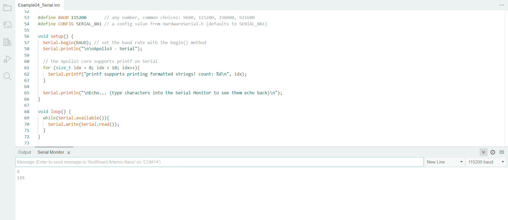
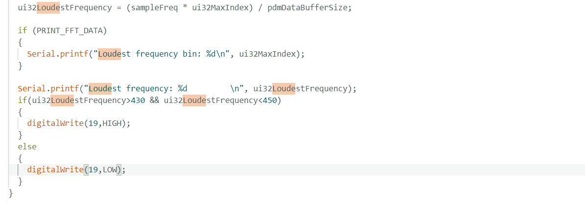

# Author: Rahul Goel (NetID: rg764)
---

[Return to Main Page](https://rahulgoel2000.github.io/)

## I. Objective

The lab's purpose is to set up and learn about the Arduino IDE and the Artemis board. In this lab, we will test some of the fundamental code examples included with Artemis, such as blinking the onboard LED, reading and sending serial messages, and using the onboard temperature sensor and pulse density microphone.

---
## II. Materials and Software

1. 1x SparkFun RedBoard Artemis Nano
2. 1x USB C to C Cable
3. Arduino IDE (Software)

---
## III. Procedure/Design/Results

#### System Setup

Installing the Arduino IDE is the first step. Next, use the USB cord to connect the Artemis to the computer. After installing the software, go to Tools and choose Boards Manager. Install the Sparkfun Apollo 3 Boards package. 

---

#### Blink It Up Example
  
Once the system is configured, go to File, Examples, 01. 
  
Basics, and open Blink. Analyze the software and select Upload from the toolbar. The Blink program activates the onboard blue LED. The algorithm toggles the LED on and off every 1000 milliseconds. 

  <iframe width="560" height="315" src="https://youtube.com/embed/0lHtGvrbmSw" frameborder="0" allow="accelerometer; autoplay; encrypted-media; gyroscope; picture-in-picture" allowfullscreen></iframe>
  
---

#### Serial Example
  
Select File, Examples, Apollo 3, and open Example04_Serial. 
 

---

#### AnalogRead Example
  
Select File, Examples, Apollo 3, and open Example02_AnalogRead.
  
AnalogRead uses the on-board ADC (analog to digital converter) to read analog voltages ranging from 0 to 2 volts. The ADC channel measures the internal die temperature, as well as the VCC and VSS voltages. Furthermore, the program is intended to fade the on-board LED to match the voltage measurement on the corresponding analog pin. 

<iframe width="560" height="315" src="https://www.youtube.com/embed/DYHK7XCOs5g" frameborder="0" allow="accelerometer; autoplay; encrypted-media; gyroscope; picture-in-picture" allowfullscreen></iframe>

---

#### MicrophoneOutput Example
  
Select File, Examples, PDM, and open Example1_MicrophoneOutput.
  
Tried whistling or speaking to change the highest frequency.

<iframe width="560" height="315" src="https://www.youtube.com/embed/w4gW0oxudmM" frameborder="0" allow="accelerometer; autoplay; encrypted-media; gyroscope; picture-in-picture" allowfullscreen></iframe>

---

#### Microphone_LED
  
  Set the board to turn on the LED when you play a musical "A" note over the speaker and off otherwise. To achieve this we used if else statements with condition if the loudest frequency is between 430 to 450 hz turn on the LED as A note is 440 hz.
     To generate the sound, use your phone, computer, or similar device. 
  

  
  <iframe width="560" height="315" src="https://www.youtube.com/embed/p8rEJC6NspE" frameborder="0" allow="accelerometer; autoplay; encrypted-media; gyroscope; picture-in-picture" allowfullscreen></iframe>
  
---

## IV. Conclusion

We successfully configured the Artemis board and the Arduino IDE before running a series of example applications to ensure system functionality. The knowledge gained in this lab regarding system setup, microcontroller familiarity, on-board peripherals, and programming will be useful in future lab trials. The experiment went well, however it's important to note that the board must be set to Artemis Nano, which is not automatically set when selecting the port on Arduino IDE.

---

