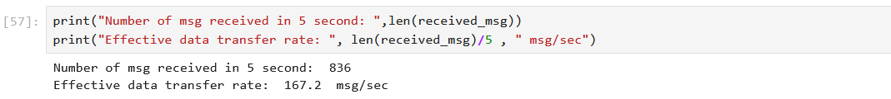
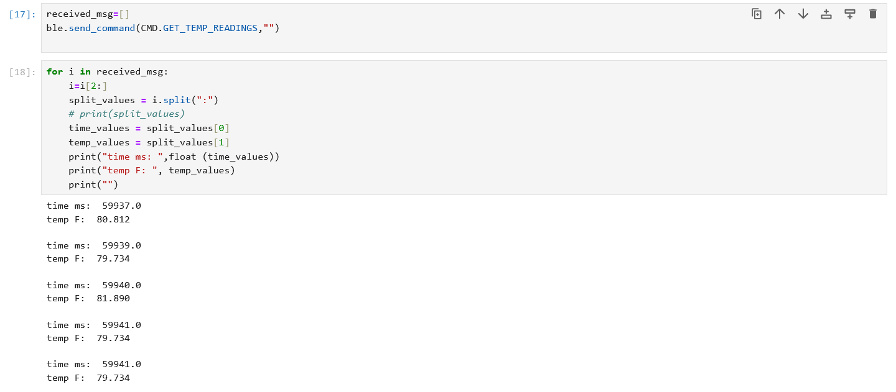

# Author: Rahul Goel (NetID: rg764)
---

[Return to Main Page](https://rahulgoel2000.github.io/)

## I. Objective

The purpose of this lab is to learn about the Bluetooth implementation used to connect the computer (off-board computing) and the Artemis board (on-board computing), as well as how to configure and initiate Bluetooth communication. 

---

## II. Materials/Software

1. 1x SparkFun RedBoard Artemis Nano
2. 1x USB A to C Cable
3. Computer
3. Arduino IDE (Software)
4. JupyterLab (Software)

---
## III. Procedure/Design/Results

#### System Setup

As part of the pre-lab setup, we created a virtual environment on our laptops (I'm running Windows 10) and installed the necessary Python libraries. We also changed the UUID and mac addresses at certain positions in the code files as instructed in the instructions to allow our Artemis board to connect to our laptops.

---

#### ECHO Command

The first task involves sending an “ECHO” command with a string value from the computer to the Artemis. The Artemis then receives the command and sends an augmented string back to the computer. As show in the images below, CMD.ECHO is utilized to send a string (HiHello) to the robot (Artemis). The Artemis then sends the string back to the computer (Robot Says -> HiHello (Received From Robot)).   

 

---

#### GET_TIME_MILLIS Command

The command requested the current time from the Artemis board. This required using the Artemis package's millis() method, converting and storing the result as a double, and passing it as a string to Python.   

time_measure is a variable with double as datatype. Created to automatically typecast millis(), which outputs a long long.

---

#### Notification Handler
 
To be able to collect data without having to explicitly call it, a Python notification handler was created to automatically receive the data. 

---

#### Gets the current time in millisecond for few seconds

On the artemis side created a loop which kept sending the timestamp using millis for continuous five seconds. recrded the data on the python end and tried to calculate the effective data transfer rate. In these case there was some gap between continuos messages being send because of the time consumed each time by the millis() function.

---
#### SEND_TIME_DATA command

In the above part instead of getting the timestamp and sharing it every time in this we first created a array that stores time stamps for contiuous 5 seconds and then send all the data at ones.  

---
#### GET_TEMP_READINGS command

In the case of SEND_TIME_DATA command along with time also made an array to store the temperature data at the corresponding timestaps and then transmit all the data at ones to the computer. On the python side split the temperature and time data and display them in a uniform manner.

#### Limitation
At 150Hz, 5 seconds of 16-bit values is 12,000 bits (150 * 5 * 16). The board has 384kB of RAM, or 3,072,000 bits (384 * 8000). This means that 256 sets of 5 second 16-bit values can be saved (3,072,000/12000). This assumes that all of the RAM is available, which is not the case; some space is given to the program; if we suppose that about 5% is filled up, we are down to approximately 243 sets.

---

#### Additional tasks for 5000: Effective Data Rate
This operation entails delivering a message from the computer to Artemis and receiving a response, as well as computing the times and data rates for each event. To measure the data rate, the "performance_measurement" function is used, which sends and receives text while keeping track of time. The ensuing for-loop adds to the string with each iteration, increasing the package's byte size. This data is then recorded and calculated to determine the data rate (bytes per second), as illustrated in the photos below. 

---
#### Additional tasks for 5000: Reliability

The reliability of the data transfer is also tested. To test the reliability of the system, we use the same code as the one used for SEND_TIME_DATA commad. If we look at the result in the following image we see that we have received all 500 messages, which are string containing timestamps are received without any data loss. The same test has been repeated with GET_TEMP_READINGS command and there we also receive all the messages sent from the artemis end. This result shows that the data transfer is very reliable even for high speed data transmission.

---

## IV. Conclusion

The goals of this lab were successfully satisfied as the experimenters utilized Bluetooth framework to interconnect the computer and the Artemis board. Knowledge gained in this lab will assist in utilizing Bluetooth in the future labs. The experiment was quite smooth, and the given references/guideline seemed to be very helpful. 

---

