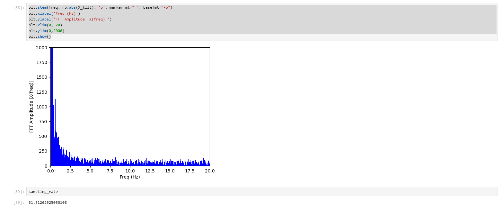

# Author: Rahul Goel (NetID: rg764)
---

[Return to Main Page](https://rahulgoel2000.github.io/)

## I. Objective

The objective of this lab is to add the IMU to our robot, start running the Artemis+sensors from a battery, and record a stunt on your RC robot. 

---

## II. Materials/Software

1. 1x SparkFun RedBoard Artemis Nano
2. 1x USB A to C Cable
3. 1x IMU Sensor
4. 1x Quik Connector
5. The RC Car kit
6. Batteries
7. Arduino IDE (Software)
8. JupyterLab (Software)

---
## III. Procedure/Design/Results

#### System Setup

Wires are connected from the Artemis Board to the IMU (Inertial Measurement Unit) Sensor using the connectors provided. 


    
---

#### Accelerometer

We used the calculations shown in the accompanying image, combined with the Arduino example script, to convert accelerometer data into roll and pitch angles (tilt). We tested the system by situating it at table edges to acquire pitch and roll data at {-90, 0, 90} degrees. The IMU (Inertial Measurement Unit) performed well with plenty noise. However, strange behavior, defined by abrupt jumps in readings, was observed around angles approaching 90 and -90 degrees. These anomalies were identified being caused by the singularities at the poles of the sphere.

 
<iframe width="560" height="315" src="https://www.youtube.com/embed/wRvZkS1aYbU?si=bGwgBbDhF9rQwY6i" title="YouTube video player" frameborder="0" allow="accelerometer; autoplay; clipboard-write; encrypted-media; gyroscope; picture-in-picture; web-share" allowfullscreen></iframe>

When we started the IMU, we found that the accelerometer reading was close to zero as expected with cnsiderable amount of noise, indicatig that no two-point calibration was needed.

As we started with the application of the low pass filter we decided to go for a FFT analysis to find the cutoff frequency. Following the instructions given, the following result was generatedas the result of FFT analysis:



From the plot we figured out that the cuttoff frequency is around 4hz (most of the spikes are to the left of the point) and after applying the simple low pass filter, the results are as follows.


Overall, the results of the simple low pass filter was little better and smooth as compared to the raw pitch and roll, but still the noise was not completely removed. 

---

#### Gyroscope

The pitch, roll, and yaw of the gyroscope was calculated by using the equations discussed in the lectures. Since the gyroscope measures the angular velocities, integration of those values will provide the tilt angles. The output of the gyroscope had much less noise compared to the output of the accelerometer. It can also be noticed that the gyroscope readings tend to drift instead of stabilizing at a particular point. This can be caused due to the noise build up in the gyroscope. Lastly, the gyroscope also requires initial value to output sensor readings. 

```
  gyro_X_angle = gyro_X_angle - sensor->gyrX() * dt;
  gyro_Y_angle = gyro_Y_angle - sensor->gyrY() * dt;
  gyro_z_angle = gyro_z_angle - sensor->gyrZ() * dt;
  SERIAL_PORT.print("Gyro Roll:");
  printFormattedFloat(gyro_X_angle,3,2);
  SERIAL_PORT.print(",");
  SERIAL_PORT.print("Gyro Pitch:");
  printFormattedFloat(gyro_Y_angle,3,2);
  SERIAL_PORT.print(",");
  SERIAL_PORT.print("Gyro Yaw:");
  printFormattedFloat(gyro_Z_angle,3,2);
  SERIAL_PORT.println();
```


Using a complementary filter of 0.1 and combining the accelerometer and gyroscope readings, precise roll and pitch angles were computed as seen below. Sensor fusion and a filter in conjunction turn out to stabilize the sensor extremely well. The results annd application of the fusion is as follows: 


---


#### Stunt with the robot

We assembled the robot with charged batteries and performed some stunts to confirm that each components of the robot works fine and to get the sense of the speed and working of the robot.

<iframe width="560" height="315" src="https://www.youtube.com/embed/nuySM396kqE?si=Ye26eMkFOCjS7Dm-" title="YouTube video player" frameborder="0" allow="accelerometer; autoplay; clipboard-write; encrypted-media; gyroscope; picture-in-picture; web-share" allowfullscreen></iframe>
---


## IV. Conclusion

The objectives of this lab were successfully completed. All the sensors were wired, tested, and equipped on the robot. The sensor programs created in this lab will assist in the future labs to autonomize the robot and capture the surroundings. This lab took roughly two weeks to complete due to soldering, as well as the several tasks associated with the sensors. Overall, the lab went quite smooth and the lab guideline proved to be very helpful. 

---


