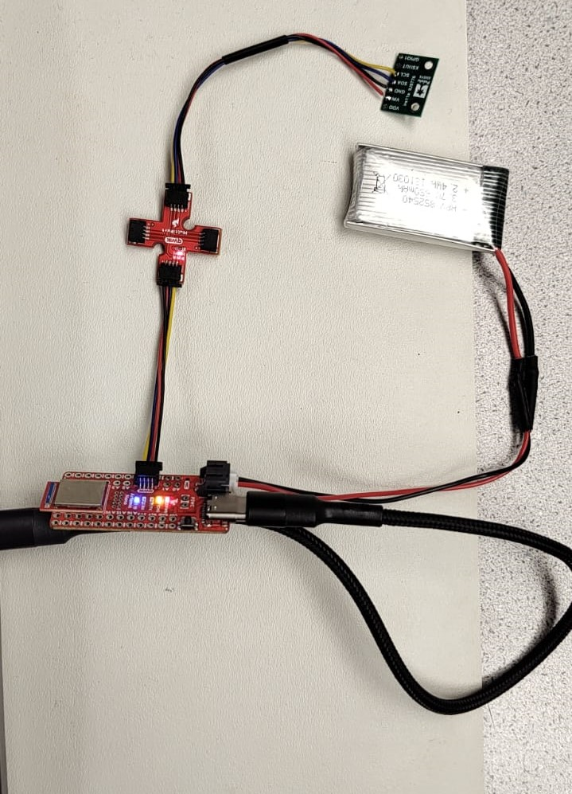
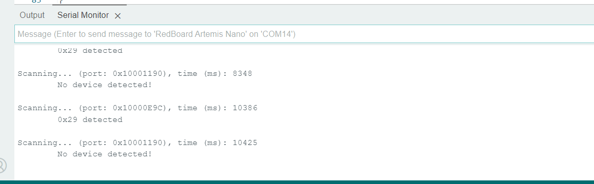
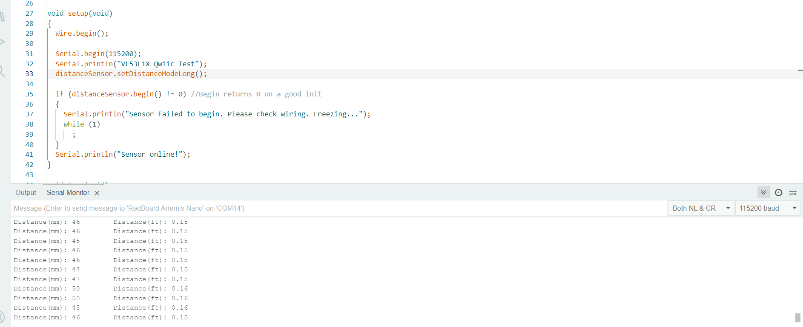
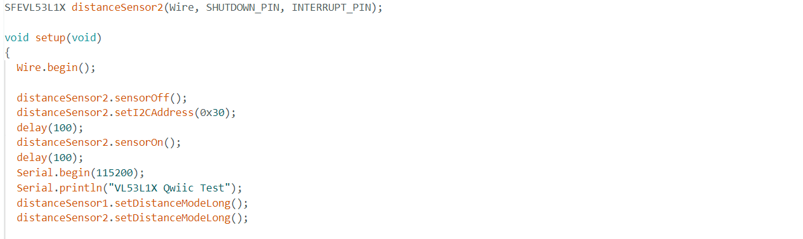
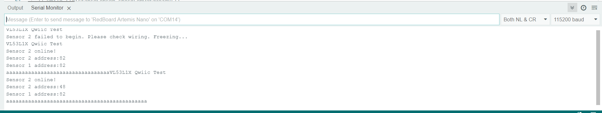
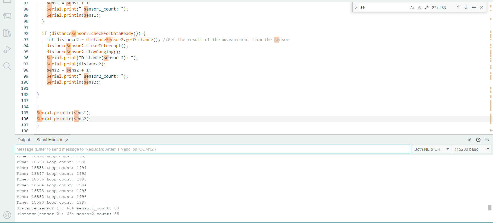
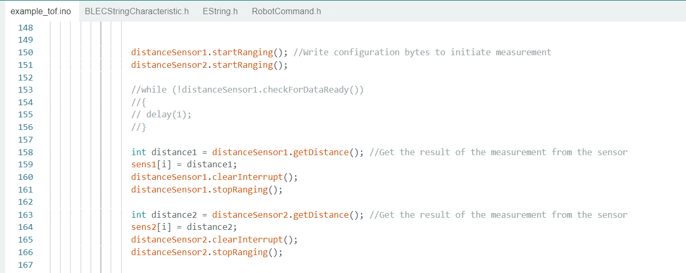
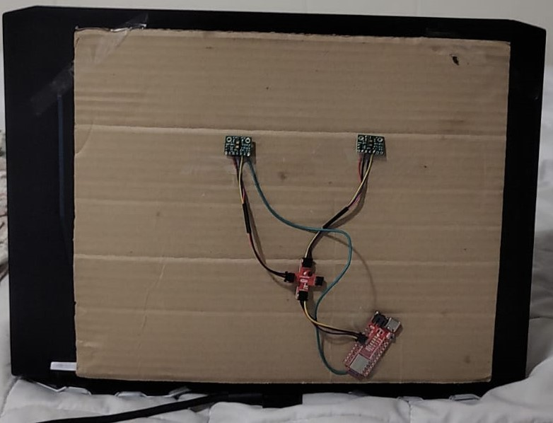
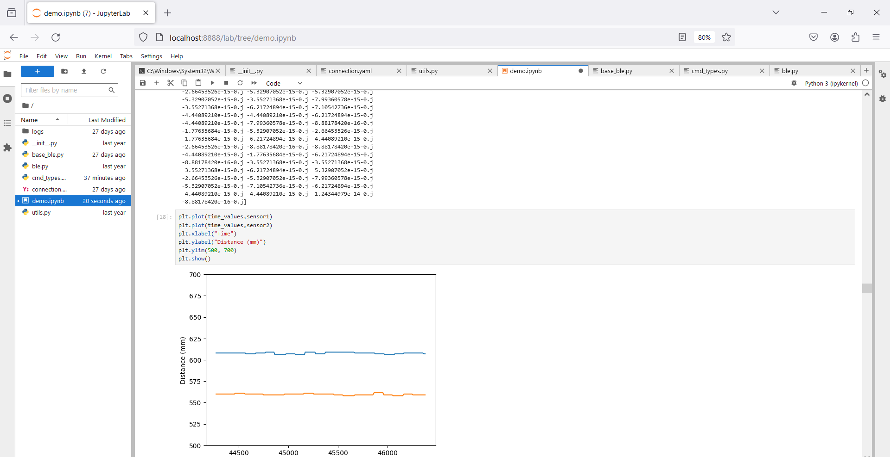

# Author: Rahul Goel (NetID: rg764)
---

[Return to Main Page](https://rahulgoel2000.github.io/)

## I. Objective

The goal of this lab is to connect and analyse two time of flight sensors in order to find an object’s distance from the robot.

---

## II. Materials/Software

1. 1x SparkFun RedBoard Artemis Nano
2. 1x USB A to C Cable
3. 2x ToF Sensors
4. QWIIC breakout board
5. 1x QWIIC Connector
6. Arduino IDE (Software)
7. JupyterLab (Software)

---
## III. Procedure/Design/Results

#### Prelab

As part of the prelab we came up with a rough circuit to connect the ToF to the Artemis. We found that QWIIC connectors are made up of following 4 pins: SDA, SCL, GND, 3.3. Also, for establishing I2C connection all the devices need to have there SDA and SCL pins connected to the master (Artems). So, accordingly we came up with the circuit and the circuit was verified in the class by actually implementing it.

---

#### System Setup

Wires are connected from the Artemis Board to the Two (2) TOF (Time of Flight) sensors soldered with QWIIC connectors to form permanent connections. We also soldered the right connector to the battery to connect and power Artemic using a battery instead of a USB connetion from the Laptop.

    
---

#### I2C adrresses scan (Example 5_Wire_I2C)

We check the addresses of the ToF sensor. This was done by compiling the example code found at File -> Examples -> Apollo3 -> Example05_Wire_I2C. It shall be noted that the program only functions correctly when there is one (1) TOF interconnected with the Artemis Board. Because, I already had two (2) TOF sensors and one (1) IMU connected before beginning this example code, the output was not as expected. Then I decided to change the stuff and check with single ToF and it worked.

---

#### Time of Flight Sensors (Short Distance Mode VS Medium Distance Mode VS Long Distance Mode)
As per the instructions provided, we were supposed to have 3 modes but when I confirmed it with the function definitions in the library found only 2, Short and Long. So, I decided to go with long, even though knowing that the response time and accuracy will not be the best but atleast I will have a good enough range.

---

#### Task 3 – Time of Flight Sensors (Read Distance)

The TOF sensor is tested using the “ReadDistance” program found at File -> Examples -> SparkFun_VL53L1X_4m_Laser_Distance_Sensor\examples\Example1_ReadDistance. As seen in the image below, the sensor was taped to a laptop and the measured distance from an flat obtained with my selected mode(long). I 

---    

#### Time of Flight Sensors (Enable Both TOF Sensors)

To enable both TOF sensors, I strategized to interconnect one TOF sensor’s shutdown pin to a GPIO in the Artemis. This will allow for the program to turn off one TOF sensor, change its address (to 0x30), and turn it back it back on. Below is the code that handles this scheme. 

---

#### Not waiting for sensors to give data

In this part we actually try writing a code which takes sensor (ToF) data whenever it is ready and skips it if it is not and just prints the time. To do these I wrote a code which keeps going throught the loop 2000 times and whenever during this process it finds a sensor is ready with the data it prints that as well along with time. Once the loop is completed we take the count of the data that comes form each sensor. The number of data we got from sensor 1 and 2 are 83 and 85 respectively, which shows the speed of the sensor is way less than the capacity of the artemis to get it and process it.

---

### Sending the data to the python side and plotting it

I started by creating a chunk of code on the artemis side which first store 200 continuous values from snsors in an array with time stamps and then send all the data to the python side. The code looks as follows:

To check the accuracy and reliabiliy of the sensors I pasted the entire setup on the back of my laptop with the help of a cardoard sheet to avoid shorting due to the metal body of my Laptop. Then keeping the Laptop at a constant distance from a wall record the data and plot it using matplotlib on the python side. 

 Looking at the result, we can say that the data is very stable and accurate with little variation over time which is acceptable.In terms of reliability the number of datapoints received is 200 and continuous shwing the reliability of sensor as well as bluetooth connection. There is slight difference in the reading of the 2 sensors which I believe is mostly related to different positions and slight differenc in orientation of the sensors.

---

#### Additional 5000 level: Infrared Transmission

The TOF sensors used in this lab measure depth/distance using infrared light (lasers). The sensor sends out a signal that impacts an object (a wall) before returning to the sensor. The time it takes for the signal to return to the sensor is utilized to calculate the distance to the item. The advantages of an IR-based TOF sensor include small box size (form factor) and minimal environmental sensitivity. The disadvantages of this type of sensor include its high cost and low sample frequency. In contrast, amplitude-based infrared sensors detect distance rather than time. The benefits of such a sensor include cost and package size. The disadvantage of these sensors is vulnerability to the environment.

In terms of impact of color, didn't had a chance to test the real stuff out with different color but as per discussions and my understanding I beleive that a complete black surface might be a problem for the sensor, as the black surfaces have the tendency to absorb infrared light beams.

---

