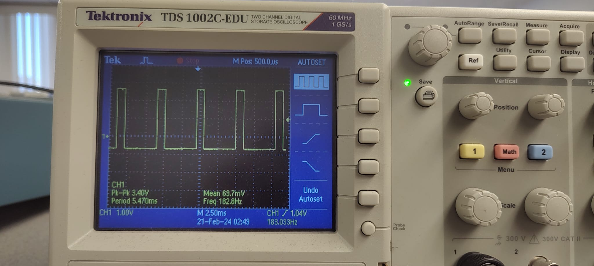
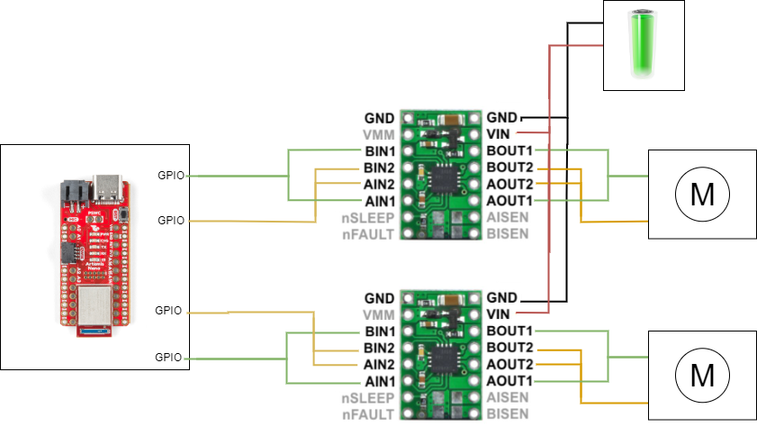
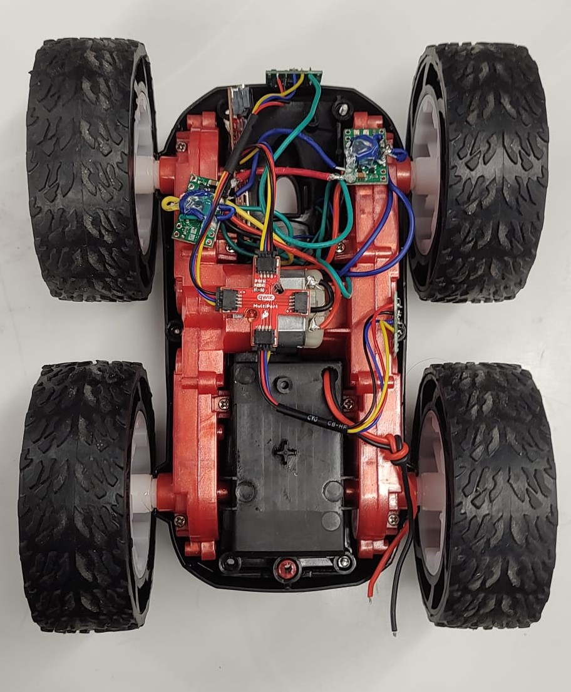
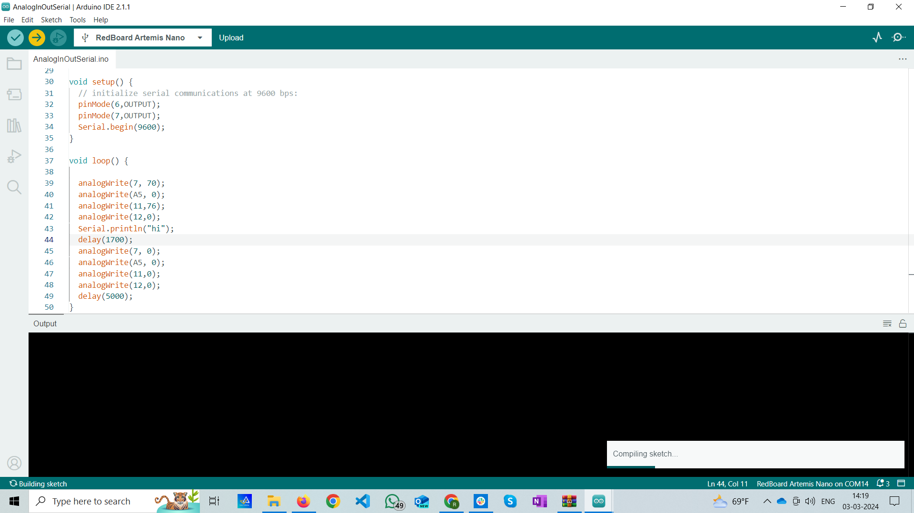

# Author: Rahul Goel (NetID: rg764)
---

[Return to Main Page](https://rahulgoel2000.github.io/)

## I. Objective

The primary objective of this lab is to change the controls of the robot from a manual scheme to an open loop scheme [1]. The off-the-shelf robot’s electronics shall be gutted and replaced by the laboratory equipment. The secondary goal of the lab is to interface the two dual motor drivers and integrate them with the Artemis. All electronics shall be securely mounted to the robot chassis upon the completion of this lab. The robot should be able to execute a programmed series of movies with the help of the two dual motor drivers. 

---

## II. Materials/Software

1. 1x SparkFun RedBoard Artemis Nano
2. 1x USB A to C Cable
3. 1x R/C Stunt Car
4. 2x Dual Motor Driver
5. 2x Li-ion 3.7V 400mAh (or more) Battery

---

## III. Procedure/Design/Results
#### Prelab 

The diagram below represents the circuit interconnections with respect to the two dual motor drivers and the Artemis board. Any analog to digital pin on the Artemis can be utilized as inputs to the motor drivers. Artemis pins A0 and A1 are used to control the first motor driver and pins A14 and A15 are used to control the second motor driver. 


---

#### One Motor Driver 

The necessary power and signal outputs are connected to the motor driver. The motor driver input wires, output wires, ground wires, and Voltage-In wire are soldered. A power supply is utilized to input a 3.7 V signal to the motor driver (to mimic the 850mAh battery). Then, oscilloscope wiring was hooked up to the output pins of the motor driver.

---

#### AnalogWrite Commands 

The following commands were added to the example analogWrite program to generate an output. The analog value of 80 is written to pin 11, and the value of 0 is written to pin 12. This signals the motor to provide a 'forward motion' output with a modified duty cycle of approximately 31.4%.

The oscilloscope reading now represents a square wave with a duty cycle of 31.4%. The negative edge of the wave still exhibits a slight decay, potentially influenced by several electronic components on the Artemis and the motor driver. The oscilloscope image below accurately replicates the observed waveform during the lab session.

```
// Motor 1

// output of 80 implies a 32% duty cycle
  analogWrite(11, 80);     // forward motion
  analogWrite(12, 0);         // backward motion
```



---

#### Taking the Car Apart

The car is taken apart to remove the off-the-shelf electronics components to be replaced by the laboratory equipment. The on-board wiring is disconnected and removed from the robot. The 850mAh battery is connected and soldered to the motor driver. 


---


#### Motor/Motor Driver

After we have tested out 1 set of motors usig the oscilloscope and ensured that it works the way it should work. We do the same thing with other motor driver and the other set of motors and place all th components on the chasis. For the secnd motor controller the GPIO pins used included pins 7 and pin A5.  One TOF sensor is placed on the front of the car while the other is placed on the side of the chassis, between two wheels. The final schematic and chasis after the complete arrangement looks as below.






---


#### Explore Lower Limit

To test the lower limit of the motor at which the robot can move, a trial and error method was used. First, the analog output of 30 (12% duty cycle) was tried which made the wheels turn, however, could not move the robot once placed on the ground. Then the analog output was gradually tested and increased until the robot was able to move. The lower limit of the motor at which the robot moves occurs at the PWM output of 42. This roughly results in a duty cycle of approximately 17%. In my case the initial movement for both the motors was almost at the same level, i.e. at 17% duty cycle.

---

#### Calibration Factor

While running the robot on the ground, it is evident that the motors do not spin at the same rate. The right motor seems to spin at a higher rate, making the robot turn rightwards instead of going straight. Therefore, a boost is provided to the left motor to spin at the same rate as the right motor. This boost can also be seen as in the value of duty cycle being given., to match the output of the right motor.





 <iframe width="560" height="315" src="https://www.youtube.com/embed/_VWVb3J8hT0" frameborder="0" allow="accelerometer; autoplay; encrypted-media; gyroscope; picture-in-picture" allowfullscreen></iframe>

<br>

 <iframe width="560" height="315" src="https://youtube.com/embed/o8marc9YJYM" frameborder="0" allow="accelerometer; autoplay; encrypted-media; gyroscope; picture-in-picture" allowfullscreen></iframe>

---

#### Open Loop Control

The robot is programmed to demonstrate open lop control by cycling through the following movement loop: 
*  Go forward
* Stop
* Turn right by 120 degrees
* Stop
* Go forward


``` 
//forward
  analogWrite(11, 76);     
  analogWrite(12, 0); 
  analogWrite(7, 70);     
  analogWrite(A5, 0);

  delay(2000);
//Stop
  analogWrite(11, 0);     
  analogWrite(12, 0); 
  analogWrite(7, 0);     
  analogWrite(A5, 0);
  
  delay(2000)
//right
  analogWrite(11, 76);     
  analogWrite(12, 0); 
  analogWrite(7, 0);     
  analogWrite(A5, 0);
  
  delay(2000)
//Stop
  analogWrite(11, 0);     
  analogWrite(12, 0); 
  analogWrite(7, 0);     
  analogWrite(A5, 0);
  
  delay(2000)
//forward
  analogWrite(11, 76);     
  analogWrite(12, 0); 
  analogWrite(7, 70);     
  analogWrite(A5, 0);

  delay(2000);


```


<iframe width="560" height="315" src="https://www.youtube.com/embed/L9quZGARVdA" frameborder="0" allow="accelerometer; autoplay; encrypted-media; gyroscope; picture-in-picture" allowfullscreen></iframe>


---


#### Additional Task: AnalogWrite Frequency

As per the Arduino – analogWrite webpage, the PWM frequency for the Nano board is 490 Hz [3]. The motor driver’s internal PWM frequency is 50 kHz, as seen on the motor driver cut sheet [2].  Manually configuring the timers to generate a faster PWM output will cause the motors to spin faster, increasing the speed of the robot. Increasing the PWM output will also provide greater control over the movements of the robot, and we will be able to send more signals in a time segment.
 
---


---


## IV. Conclusion

The objective of this lab, to demonstrate an open loop control scheme was successfully satisfied. The knowledge gained from this lab in regards to programming the Artemis and interfacing with the dual motor drivers will be very useful in future labs. One issue encountered during the lab was the short battery life of the 850mAh battery (~ 9 minutes). In the future, it will be helpful to keep more batteries in the kit. Overall, the lab was quite smooth and the lab guideline seemed to very helpful. 

<p>Moving onto finding the minimum duty cycle at which the robot can keep moving. Started the robot with set value of 32 and kept it on the ground. It was not moving. Tried pushing it a bit and it started to move. Not very straight but it was abl to move at this duty cycle.<\p> 

---

## V. References

1. [ECE 5960 – Lab 5 Guideline](https://cei-lab.github.io/ECE4960-2022/Lab5.html)
2. [Motor Driver Data sheet](https://www.ti.com/lit/ds/symlink/drv8833.pdf?HQS=dis-dk-null-digikeymode-dsf-pf-null-wwe&ts=1646842101533&ref_url=https%253A%252F%252Fcei-lab.github.io%252F)
3. [Arduino analogWrite Command](https://www.arduino.cc/reference/en/language/functions/analog-io/analogwrite/)

---

[Return to Main Page](https://rahulgoel2000.github.io/)


