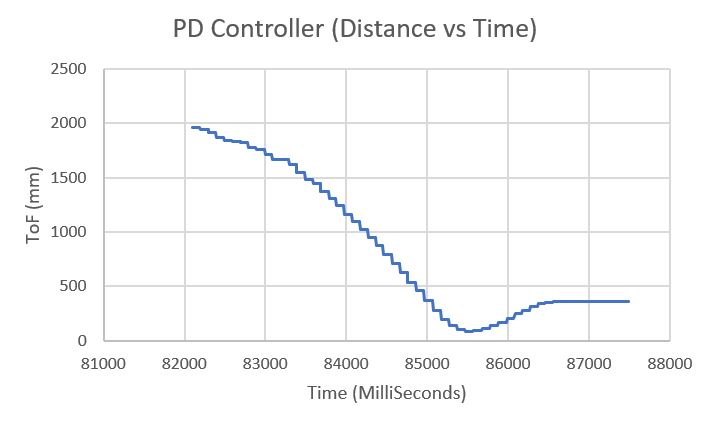
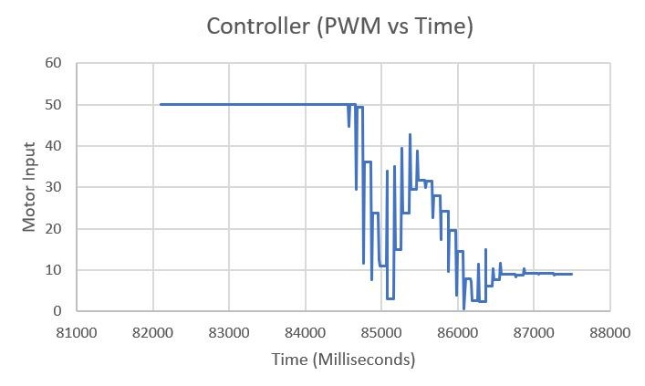
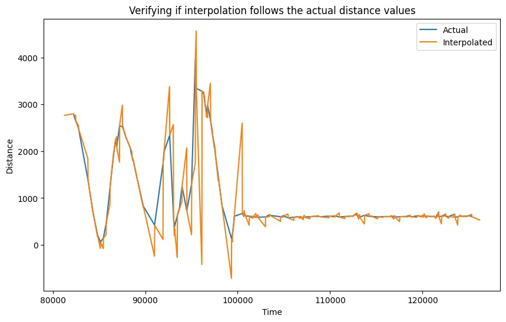
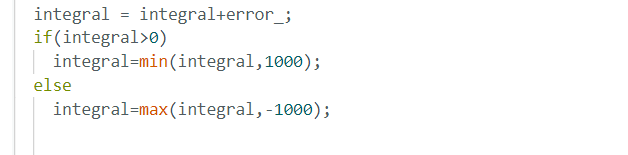

# Author: Rahul Goel (NetID: rg764)
---

[Return to Main Page](https://rahulgoel2000.github.io/)

## I. Objective

The primary objective of this lab is to implement a Closed-Loop Control (PID) system to control the robot positioning with respect to obstacles. “Don’t Hit the Wall” is the first, which revolves around driving towards a wall, then stopping at exactly a particular with the help of ToF sensor readings and the PID controller.

---

## II. Materials/Software

1. 1x SparkFun RedBoard Artemis Nano
2. 1x USB A to C Cable
3. 1x R/C Stunt Car
4. 2x Dual Motor Driver
5. 2x Li-ion 3.7V 650mAh (or more) Battery
6. 2x 4m ToF Sensor
7. 9DOF IMU Sensor
9. 1x Qwiic Connector
10. Measuring Tape

---

## III. Procedure/Design/Results
#### Prelab 

To send and receive data, the BLE and Jupyter framework are first setup. I am only sending the data of the one ToF sensor with time and PWM as that is the only thing needed for this lab.

```
dist_array[counter] = distance;
time_array[counter] = time_current;
pwm_array[counter] = internalSpeed;
for (int i = 0; i < counter; i++){
      tx_estring_value.clear();
      tx_estring_value.append(dist_array[i]);
      tx_estring_value.append("|");
      tx_estring_value.append(time_array[i]);
      tx_estring_value.append("|");
      tx_estring_value.append(pwm_array[i]);
      tx_characteristic_string.writeValue(tx_estring_value.c_str());
   }
```

For the above code to work, several issues may need to be debugged. For example, buffer overflow is an issue that came up which was solved by limiting the size of the arrays or stopping the program after a certain number of seconds. Another issue that came up was a “hard-fault” error which was caused by storing a float value into a static long value. This was resolved by matching the formats of both values (float values). 

The Jupyter file was setup to receive the data under a notification handler. A CMD command (START_REC) is used to trigger the PID and data recording on the Artemis. Another CMD command (SEND_DATA) is used to stop the PID and data recording and start transmitting the information to Jupyter. The following code is used to represent the described logic. 

```
def notification_handler(uuid, value):
    global distance
    distance=ble.bytearray_to_string(value) 
    print(distance)
ble.start_notify(ble.uuid['RX_STRING'], notification_handler)
ble.send_command(CMD.START_REC, "")
ble.send_command(CMD.SEND_DATA, "")

```

---

#### PID Controller 

A PID controller is a very well-known closed loop control system used for numerous applications. The control scheme operates by providing the required output to a meet a specified setpoint. Sensors are often used to determine the error in the controller so that the feedback can be adjusted accordingly to meet the setpoint. For this lab, a PID controller is utilized which outputs the PWM duty cycle that is used to drive the motors.  Upon trial and error, it was noticed that the controller is the most effective when the KP value is 0.04, KI value is 0.01 and the KD value is 0.08. The KD value is high as it was not deemed effective for lower values. The following code is used to compute the PID output. It shall be noted that the PID controller is made from scratch. 

```
  // Calculate the derivative term
  float derivative = error_ - lastError;

  // Calculate the PID output
  new_duty = kp * error_ + ki * integral + kd * derivative;

  // Update the last error for the next iteration
  lastError = error_;
```

---


Now, the task involves driving as fast as possible towards a wall, then stopping at exactly 300mm away with the help of ToF sensor readings and the PID controller. Several considerations are explored to come up with a control scheme. 

To accomplish the performance shown in the videoes below, I started first with a simple P controller with no reverse velocity if under the desired distance, got to a point where I was able to see decent stopping performance then I went to implement the entire PID. 

The following videos represent different test runs with different PID parameter settings. 


<iframe width="560" height="315" src="https://youtube.com/embed/2DTsQg6cHS8" title="YouTube video player" frameborder="0" allow="accelerometer; autoplay; clipboard-write; encrypted-media; gyroscope; picture-in-picture; web-share" allowfullscreen></iframe>

<iframe width="560" height="315" src="https://www.youtube.com/embed/rh51xbuZ-mQ?si=uUK6WTnnOAOHhUkf" title="YouTube video player" frameborder="0" allow="accelerometer; autoplay; clipboard-write; encrypted-media; gyroscope; picture-in-picture; web-share" allowfullscreen></iframe>

<iframe width="560" height="315" src="https://youtube.com/embed/xHNJWn2iVeg" title="YouTube video player" frameborder="0" allow="accelerometer; autoplay; clipboard-write; encrypted-media; gyroscope; picture-in-picture; web-share" allowfullscreen></iframe>

<iframe width="560" height="315" src="https://www.youtube.com/embed/jL2jgCx7xVA?si=ZwIGztX4RvimAFQS" title="YouTube video player" frameborder="0" allow="accelerometer; autoplay; clipboard-write; encrypted-media; gyroscope; picture-in-picture; web-share" allowfullscreen></iframe>

The last video is the final tuned control results and it seems to work the way it should. Initially it gets closer than the desired distance, fires reverse duty and goes in reverse and then repeats the same cycle for couple of times ut with less ammpletude and comes to rest.

Below are the Distance VS Time and Motor Input VS Time graphs for Test Run 3 (video 3). 






---

#### Linear Interpolation

The speed at which ToF provides data is slow and to enhance it linear interpolation was introduced. The interpolation method allowed the measuremnet reading to be used whenever it was ready else used the past measurements to get a probable value of distance to get the error for the pid.

```
sens2_int_val = (((secondlast_val2 - last_val2)/(secondlast_time2 - last_time2))*(time_[loop_]-last_time2))*0 + last_val2;

```



#### Proportional Controller Range Reasonable Range

Proportional controller’s theoretical range can be determined by calculating the upper and low bounds of the constant KP. The lower bound can be determined by dividing the highest possible PWM output, by the sensor’s range (160/4000mm). This results in the minimum KP value of ~0.04. Following this it was manually altered by trial and error but found that 0.04 is adequate and usable value for best performance.

---

#### ToF Sensor Range

The ToF sensor’s range and sampling time play a major role in the quality of the PID control that can be achieved in this lab. ToF sensor’s long range mode is utilized in the lab so that ranges can be determined from much longer distance. This can be vital as the PID controller can start controlling the robot’s deceleration from a much farther distance (in long range mode), making the control scheme more effective. 

---

#### Derivative Controller Kick
The derivative-aspect of the utilized PD controller results in a “derivative kick” which is a phenomenon in which the value of the error changes suddenly whenever the set point is adjusted. This sudden jump in the error causes the derivative to be very large which may cause the controller to saturate. To combat this issue, a low pass filter can be used to decrease the noise in the derivative error and smooth out the control signal. Had there been more time, a low pass filter would have been implemented for this lab. 

---

#### Integral Wind Up

Integral wind up is a phenomenon where a large change in setpoint causes the integral term to accumulate a large error during the rise. This causes the controller to overshoot and oscillate until the error is unwound. So, adding a constrain on the integral value can help in tackling this.



---

## IV. Conclusion

The objective of this lab, to demonstrate a closed loop control scheme was successfully satisfied. This lab was extremely challenging yet very rewarding. There were several issues faced during the lab such as hardware faults, software bugs (BLE). Overcoming these challenges was very satisfying and helpful as the experimenter understood the causes of these issues. The knowledge gained from this lab in regards to programming the Artemis (C++), interfacing with the motor drivers and sensors, implementing PID control, and jupyter (python) will be very useful in the future labs. The staff was also extremely helpful during the lab. 

---

## V. References

1. [ECE 5960 – Lab 2 Guideline](https://fastrobotscornell.github.io/FastRobots/labs/Lab5.html)
2. [PID Theory Explained – NI](https://www.ni.com/en-us/innovations/white-papers/06/pid-theory-explained.html)

---

[Return to Main Page](https://rahulgoel2000.github.io/)


