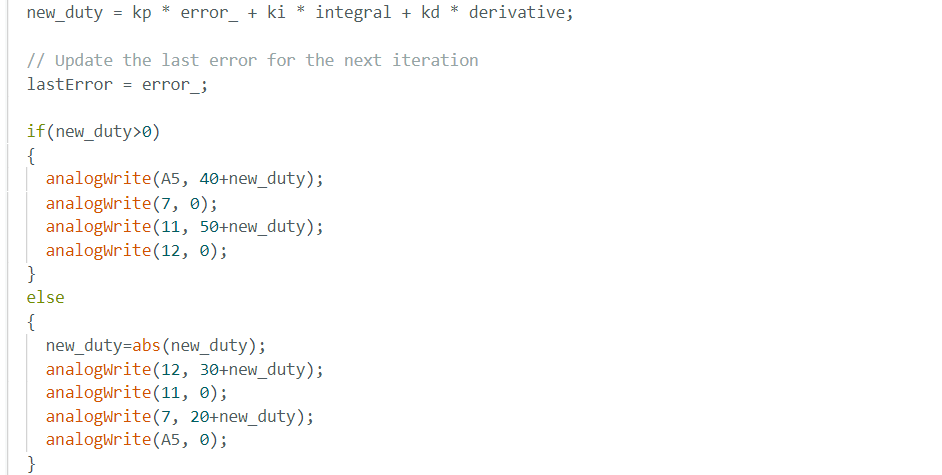
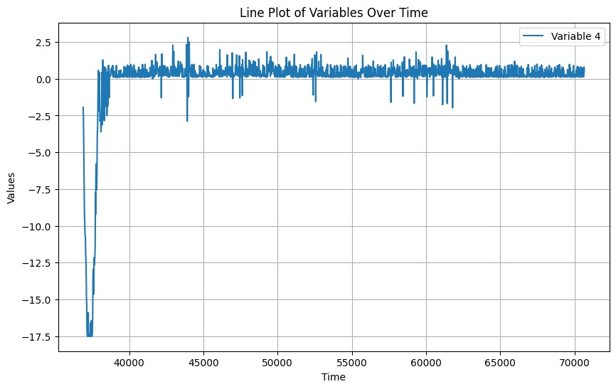
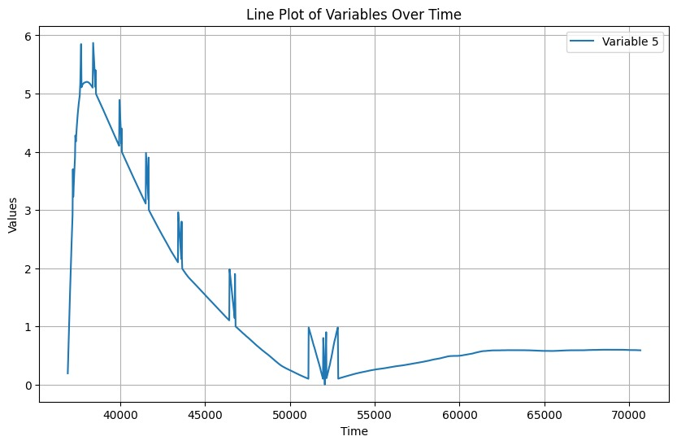
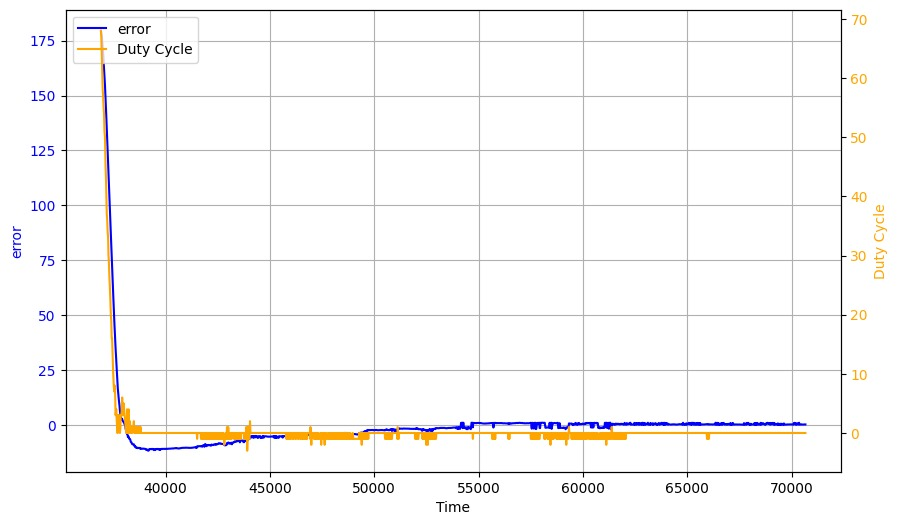
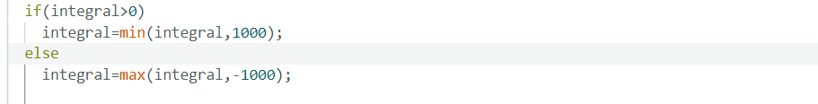

# Author: Rahul Goel (NetID: rg764)
---

[Return to Main Page](https://rahulgoel2000.github.io/)

## I. Objective

The goal of the lab is to get a good understanding of a PID control which is able to control the orientation of the bot as per the given instructions and angle from the gyroscope of the IMU. 


---

## II. Materials/Software

1. 1x SparkFun RedBoard Artemis Nano
2. 1x USB A to C Cable
3. 1x R/C Stunt Car
4. 2x Dual Motor Driver
5. 2x Li-ion 3.7V 650mAh (or more) Battery
6. 9DOF IMU Sensor
7. 1x Qwiic Connector


---

## III. Procedure/Design/Results
#### Prelab 

The prelab is pretty similar to the last lab where we set up our Artemis to send data to the jupyter notebook and at the same time set up jupyter notebook to be able to change the parameters on the Artemis in real time.

Also, the other required part is to get the IMU mounted on the bot along with ensuring that it is able to give required data.

#### PID Controller 

A PID controller is a very well-known closed loop control system used for numerous applications. The control scheme operates by providing the required output to a meet a specified setpoint. Sensors are often used to determine the error in the controller so that the feedback can be adjusted accordingly to meet the setpoint (initially set to zero and then can be changed from jupyter over bluetooth.). For this lab, a PID controller is utilized which outputs the PWM duty cycle that is used to drive the motors based on the angle calculated using the gyroscope of the IMU.  Upon trial and error, it was noticed that the controller is the most effective when the KP value is 0.9, KI value is 0.06 and the KD value is 2. The following code is used to compute the PID output. It shall be noted that the PID controller is made from scratch. 

```
  // Calculate the derivative term
  float derivative = error_ - lastError;

  // Calculate the PID output
  new_duty = kp * error_ + ki * integral + kd * derivative;

  // Update the last error for the next iteration
  lastError = error_;
```

---


Now, the task involves setting the duty cycles of the wheels on the both side of the bot in opposite direction depending on the sign and value of the error to make the bot turn in the directon of the setpoint( required orientation ).




<iframe width="560" height="315" src="https://youtube.com/embed/awTLPnJGBPk" title="YouTube video player" frameborder="0" allow="accelerometer; autoplay; clipboard-write; encrypted-media; gyroscope; picture-in-picture; web-share" allowfullscreen></iframe>

<iframe width="560" height="315" src="https://youtube.com/embed/82FpG_-WnvI" title="YouTube video player" frameborder="0" allow="accelerometer; autoplay; clipboard-write; encrypted-media; gyroscope; picture-in-picture; web-share" allowfullscreen></iframe>

<iframe width="560" height="315" src="https://youtube.com/embed/bhA3t8IwX68" title="YouTube video player" frameborder="0" allow="accelerometer; autoplay; clipboard-write; encrypted-media; gyroscope; picture-in-picture; web-share" allowfullscreen></iframe>


The first video is to show an imperfectly tuned PID.

The second and last video is the final tuned control results and it seems to work the way it should. Initially it gets closer than the desired orientation, fires reverse duty and goes in reverse and then repeats the same cycle for couple of times ut with less ammpletude and comes to rest.

Below are some of the curves which were used for this lab. 





---


#### Derivative Controller Kick
The derivative-aspect of the utilized PD controller results in a “derivative kick” which is a phenomenon in which the value of the error changes suddenly whenever the set point is adjusted. This sudden jump in the error causes the derivative to be very large which may cause the controller to saturate. To combat this issue, a low pass filter can be used to decrease the noise in the derivative error and smooth out the control signal. Had there been more time, a low pass filter would have been implemented for this lab. 

---

#### Integral Wind Up

Integral wind up is a phenomenon where a large change in setpoint causes the integral term to accumulate a large error during the rise. This causes the controller to overshoot and oscillate until the error is unwound. So, adding a constrain on the integral value can help in tackling this.




#### Issue with Gyro readings for orientation

Gyroscopes measure angular velocity, not absolute orientation. Integrating angular velocity over time to estimate orientation can lead to drift, where small errors accumulate over time, causing the estimated orientation to deviate from the true orientation. The way to minimise this can be using low pass filters and if available fusing with some other sources of orientation, or go for a complementary filter with the accelerometer.

#### Bias

Gyroscopes do have some bias and the easiest way to takle that is introducing a correction term to the gyro calculation equation which is equal to the startup value of the Gyroscope and remains constant.


---

## IV. Conclusion

The objective of this lab, to demonstrate a closed loop control scheme was successfully satisfied. This lab was extremely challenging yet very rewarding. There were several issues faced during the lab such as hardware faults, software bugs (BLE). Overcoming these challenges was very satisfying and helpful as the experimenter understood the causes of these issues. The knowledge gained from this lab in regards to programming the Artemis (C++), interfacing with the motor drivers and sensors, implementing PID control, and jupyter (python) will be very useful in the future labs. The staff was also extremely helpful during the lab. 


---

[Return to Main Page](https://rahulgoel2000.github.io/)


